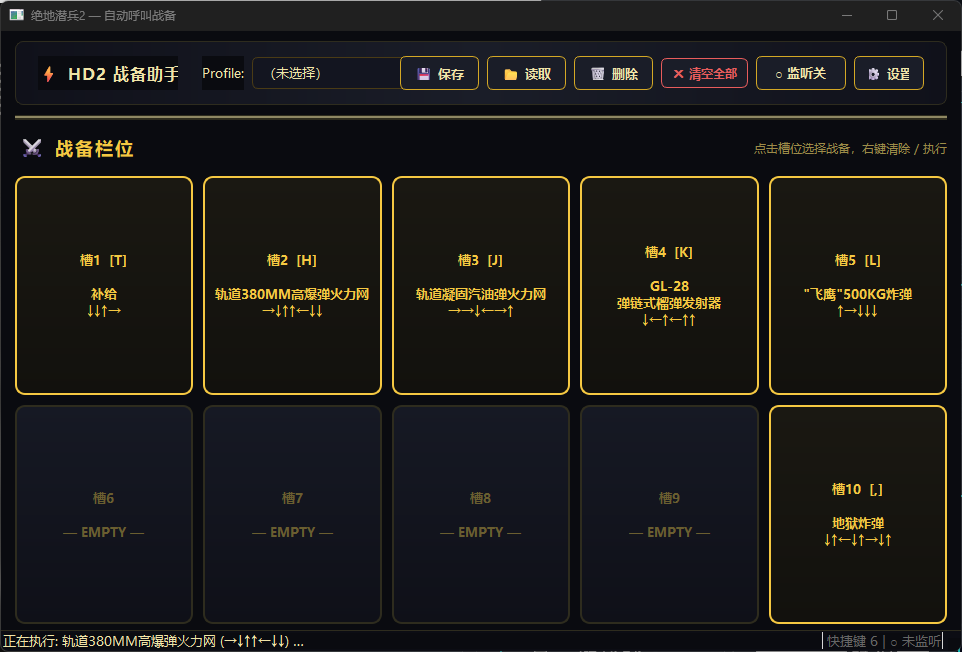

# Helldiver2AutoCommand

绝地潜兵2 自动呼叫战备工具 — Helldivers 2 Auto Stratagem Caller一键自动输入战备指令码，支持 Profile 存档管理。

## 功能特性

- **2×5 战备栏位网格** — 10 个可配置槽位，点击即可通过级联菜单选择战备
- **级联分类菜单** — 点击槽位弹出一级分类菜单，展开后选择具体战备：
  - 任务战备 · 轨道火力 · 飞鹰 · 支援武器 · 哨戒炮 · 地雷和 emplacements · 背包 · 载具
- **完整战备数据库** — 收录 80 条战备（型号、名称、指令码、描述）
- **Profile 存档系统** — 保存 / 读取 / 删除命名配置方案，快速切换不同任务负载
- **全局快捷键监听** — 为每个槽位绑定独立快捷键，游戏中按下即自动执行战备指令
- **自定义按键绑定** — 方向键映射（默认 WASD）、战备激活键、按键延迟均可自定义
- **Windows SendInput API** — 使用 ctypes 直接调用 SendInput，完美支持右 Ctrl 等扩展键

## 运行要求

- Python 3.13+
- PyQt6
- keyboard（全局快捷键监听，需管理员权限）
- Windows 系统（SendInput API）

## 安装

```bash
pip install -r requirements.txt
```

或使用 uv：

```bash
uv run app.py
```

## 使用方法

```bash
python app.py
```

### 界面布局



### 操作说明

1. **选择战备** — 左键点击任意槽位，弹出分类菜单 → 选择分类 → 选择战备
2. **执行战备** — 右键点击已绑定的槽位 → 选择「▶ 执行」
3. **清除槽位** — 右键点击 → 选择「✕ 清除」
4. **设置快捷键** — 右键点击 → 选择「⌨ 设置快捷键…」→ 按下目标按键
5. **保存 Profile** — 点击「💾 保存」，输入名称，当前 10 个槽位配置将被保存
6. **读取 Profile** — 下拉选择 Profile → 点击「📂 读取」
7. **按键设置** — 点击「⚙ 设置」修改方向键绑定、激活键和延迟
8. **全局监听** — 点击「监听开/关」切换，开启后可在游戏中用快捷键触发

## 按键配置

默认按键绑定（可在设置中修改）：


| 方向 | 默认按键 |
| ---- | -------- |
| ↑   | W        |
| ↓   | S        |
| ←   | A        |
| →   | D        |

- **战备激活键**: `Ctrl`（游戏中按住打开战备输入模式）
- **按键延迟**: `0.05` 秒

配置保存在 `config.json`，Profile 存档保存在 `profiles/` 目录。

## 项目结构

```
├── app.py           # 主程序 & PyQt6 GUI 界面
├── stratagems.py    # 战备数据定义（8 大分类，80 条战备）
├── config.py        # 按键配置 & Profile 存档管理
├── executor.py      # Windows SendInput API 按键模拟
├── config.json      # 用户配置文件（自动生成）
├── profiles/        # Profile 存档目录（自动生成）
├── tests.py         # 单元测试
├── pyproject.toml   # 项目元数据
└── requirements.txt # 依赖列表
```

## 注意事项

- Windows 上需以**管理员权限**运行（keyboard 模块要求）
- 请确保游戏窗口处于**前台**运行状态
- 右 Ctrl 等扩展键已通过 SendInput + `KEYEVENTF_EXTENDEDKEY` 正确处理
